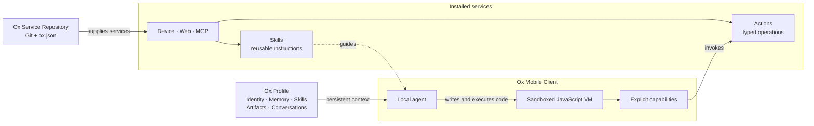

# Ox Protocol

OpenOx is a protocol for personal agents that run locally on mobile devices and gain capabilities through portable service repositories.

- **Ox Client** — A mobile application that implements the OpenOx protocol. It hosts the Ox VM, opens an Ox Profile, and connects the agent to services.
- **Ox Profile** — A portable folder containing the agent’s persistent state: its identity, memory, skills, artifacts, and conversation history.
- **Ox Service Repository** — A versioned collection of services described by an `ox.json` manifest. Each service may provide:
  - **Actions** — Typed operations the agent can invoke.
  - **Skills** — Reusable instructions that teach the agent when and how to use those actions.

Each Ox Client hosts a sandboxed JavaScript VM where the local agent writes and executes code. The VM has no direct access to the network, filesystem, or mobile device. Instead, it operates through explicit capabilities exposed by the client.

OpenOx supports three kinds of services:

1. **Device services** expose capabilities provided by the mobile client.
2. **Web services** expose actions backed by websites and the user’s browser session.
3. **MCP services** expose actions provided by an MCP server.

Anyone can publish compatible services in a public Git repository containing an `ox.json` manifest. Any compatible mobile client can install that repository and make its services available to the agent.

**Ox for iOS** is the reference implementation of an OpenOx client. Its agent runtime and VM run on the user’s iPhone.
