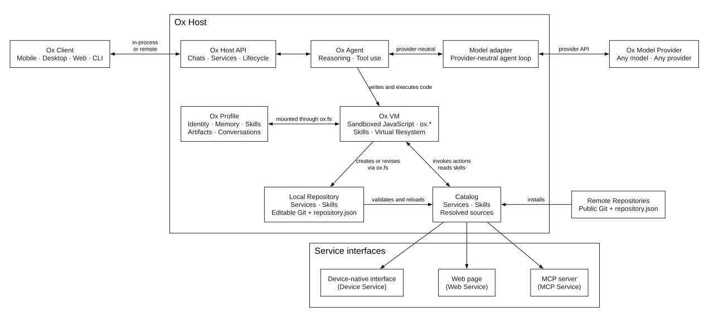

<div align="center">


<h1>OpenOx</h1>

OpenOx: A protocol for an open ecosystem of self-evolving agents.

<h3>

[Website](https://openox.ai) · [TestFlight](https://testflight.apple.com/join/Y3x7nxj9) · [Discord](https://discord.gg/7baSAHZTA)

</h3>

[](https://github.com/ziyzhu/openox/stargazers)
[](https://github.com/ziyzhu/openox/actions/workflows/ci.yml)

</div>

---

Each self-evolving agent is called an Ox. Every Ox follows three principles:

1. **Acts everywhere** — Ox turns websites into reusable actions, then runs them much faster than you could by hand.
2. **Distributed evolution** — Each Ox self-evolves by creating new actions and skills locally. It can also co-evolve with other Ox by sharing and adopting capabilities through repositories.
3. **Stays yours** — Ox runs on your device, keeps your data there, and works with any model provider including self-hosted. It asks before sensitive actions and isolates account credentials in the web page.

The first implementation of Ox is an iOS app whose source code is included in this repository. Download it via TestFlight [here](https://testflight.apple.com/join/Y3x7nxj9).

## Components



- **Ox Client** — An interface that connects to an Ox Host. A Client may be a mobile app, desktop app, web app, or command-line tool.
- **Ox Host** — A process or device that opens an Ox Profile, runs the Ox VM, and supplies platform and service adapters. A Client can use an embedded Host or target a compatible Host elsewhere.
- **Ox Agent** — The reasoning and tool-using process that pursues the user's goals using the selected model, the state in an Ox Profile, and the capabilities exposed through the Ox VM.
- **Ox Model Provider** — The language model selected by the user. OpenOx does not prescribe a model or provider; the Host adapts provider-specific APIs to the provider-neutral agent loop.
- **Ox Profile** — A portable folder containing the agent’s persistent state: its identity, memory, skills, artifacts, and conversation history.
- **Ox VM** — The platform-neutral agent execution contract supplied by an Ox Host. The iOS Host implements it with a sandboxed JavaScript runtime where the agent writes and executes code. Through `ox.*`, the VM exposes explicit Host capabilities for interacting with the Profile, services, web, user, and device. Its `ox.fs` virtual filesystem mounts Profile content, skills, service definitions, persisted chats, and user-granted files while enforcing each source’s permissions.
- **Ox Service Repository** — A versioned collection of services described by a `repository.json` manifest. Each Ox Host manages an editable Local repository and can install compatible remote repositories. Each service exposes typed actions the agent can invoke and may include reusable skills that teach the agent when and how to use them.

## Distributed Evolution

Each Ox can self-evolve locally and, optionally, co-evolve with others. An Ox self-evolves through the VM, which lets it invoke an existing service while creating another one. On iOS, the built-in Browser device service can navigate and inspect a target website, perform approved interactions, and capture the relevant network exchanges. Ox can use that evidence to create a reusable web service:

1. The agent invokes Browser or another attached service from the VM to gather evidence for the required capability.
2. The agent uses `ox.fs` to write or revise the service manifest, actions, and optional skills in its Local Service Repository.
3. The Host validates each source mutation, and the agent uses `ox.service.attach` to load or reload the service for the chat.
4. The agent can invoke new actions later in the same turn or in subsequent turns. New skills guide subsequent agent work.
5. Local Git can record the changes for inspection, reversal, and publication.

An Ox can therefore gain and apply a capability independently, without rebuilding or updating the Host or Client. Co-evolution is optional: an Ox can publish capabilities to shared repositories and install capabilities created by other Ox.

## Ox Client

A Client selects an Ox Host and, when needed, a chat. The Host binds VM execution to that conversation, its permissions, attached services, and virtual filesystem view. The Client can embed its Host or connect to a compatible Host elsewhere.

## Ox Host

The Host opens an Ox Profile, runs the Ox VM, and supplies the adapters that connect the VM to models, services, and platform capabilities.

## Ox Model Provider

The user selects the language model. The Host adapts provider-specific APIs to the provider-neutral agent loop, so neither the OpenOx protocol nor an Ox Profile is tied to one provider.

## Ox Profile

The Profile is the portable home of an Ox. It keeps the agent's identity, memory, skills, artifacts, and conversation history together so the agent's persistent state can move independently of a particular Client or model.

## Ox VM

The VM is the platform-neutral contract between skills and the Host. Skills depend on this contract rather than the Host platform or implementation language.

The VM has no direct access to the network, Host filesystem, or mobile device. It operates through `ox.*`, with `ox.fs` presenting mounted content as a stable namespace without revealing its backing storage.

The execution model, JavaScript capability bridge, limits, and virtual filesystem are documented in [`docs/VM.md`](docs/VM.md).

## Ox Service Repository

OpenOx supports three kinds of services:

1. **Device services** are supplied by the Host's platform adapters and expose capabilities such as Browser.
2. **Web services** expose actions backed by websites and the user’s browser session.
3. **MCP services** expose actions provided by an MCP server.

Anyone can publish compatible web and MCP services in a public Git repository containing a `repository.json` manifest. Any compatible Host can install that repository and make its services available to the agent. Device services remain part of the Host implementation.

## The first Ox

**Ox for iOS** is the reference implementation of both an Ox Client and an Ox Host. Its agent runtime and VM run on the user’s iOS device, while the embedded Client supplies the native interface.

The native Client reaches the `OxHost` contract in process, while the development
CLI reaches that same Host through `OxHostProtocol` over
`WebSocketOxHostTransport`. Both paths share the Host-owned chat, service,
Profile, model, and VM runtime.

Install Xcode 26 or later and Bun on a Mac, then clone the repository:

```sh
git clone https://github.com/ziyzhu/openox.git
cd openox
bun install
```

Create a local signing configuration:

```sh
cp apps/ios/Local.xcconfig.example apps/ios/Local.xcconfig
```

Edit the ignored `apps/ios/Local.xcconfig` with your Apple Developer Team ID and a reverse-DNS bundle identifier owned by your team. The app derives its storage identifiers from the bundle identifier and declares canonical OpenOx package types. Register the App Group and iCloud container with your Apple development team if Xcode does not create them automatically.

Open `apps/ios/Ox.xcodeproj`, select a physical device, and run the `ios` scheme. The checked-in service bundle contains every built-in web, native iOS, and MCP service.

Built-in service sources live under `repositories/builtin/`. Regenerate the committed iOS bundle after changing them:

```sh
bun run build:services
```

To use a different service repository while developing, serve it explicitly:

```sh
ox repository serve /path/to/service-repository --port 8101
```

The Ox CLI is another Client. During development it can discover and target the Host in a running iOS Simulator, inspect chats and logs, run agents, and exercise the same VM contract the agent sees:

```sh
ox discover
ox chat list
ox chat inspect
ox logs --follow
ox vm inspect
ox vm functions
ox vm call ox.fs.list --args '{"path":"skills","purpose":"List VM skills"}'
```

Use `--host <ws-url>` or `OX_HOST_ENDPOINT` when the Host does not use the default loopback endpoint. The iOS Host control endpoint is currently available only in DEBUG Simulator builds.

[`examples/service-repository`](examples/service-repository) is a standalone repository users can copy when creating their own remote services.

## Community

[Discord](https://discord.gg/7baSAHZTA)

## Acknowledgement

[Pi](https://github.com/earendil-works/pi): Ox's main Swift agent loop referenced Pi.

[Cloudflare](https://blog.cloudflare.com/code-mode/): Ox's architecture was influenced by Code Mode and agent sandboxing.

[OpenClaw](https://github.com/openclaw/openclaw): Ox's system prompts referenced some of OpenClaw's.

[zappa: an AI powered mitmproxy](https://geohot.github.io/blog/jekyll/update/2026/04/15/zappa-mitmproxy.html): Ox adopts a similar idea but applied to mobile.

[OpenCLI](https://github.com/jackwener/opencli): Ox's web service integration referenced some crawling techniques from OpenCLI.

[Defuddle](https://github.com/kepano/defuddle): Ox's HTML to Markdown parser uses Defuddle.
