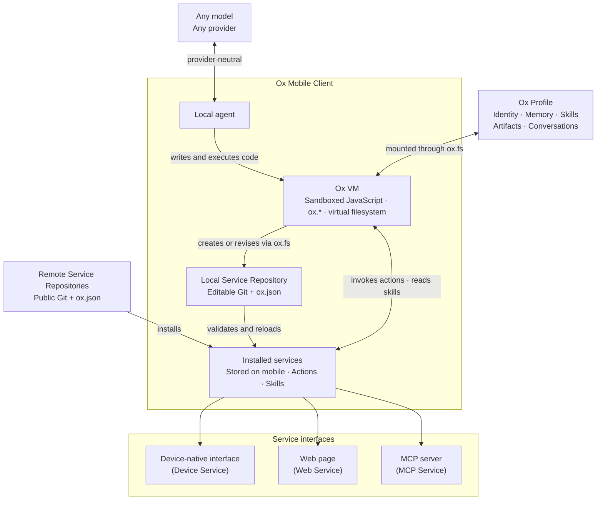

## OpenOx

OpenOx is a protocol for self-evolving agents that run locally on mobile devices.

Each such agent is called an Ox and follows three principles:

1. Acts everywhere. Ox turns websites into reusable actions. You can use one that already exists or ask Ox to build a new one for you.
2. Yours, by design. Ox runs on your device, keeps your data there, and works with any model, including free or self-hosted ones.
3. Peace of mind. Ox asks before sensitive actions, keeps account credentials isolated on the web page, and lets you pull the plug at any time.

The first implementation of Ox is an iOS app whose source code is included in this repository. You can download it through TestFlight: https://testflight.apple.com/join/Y3x7nxj9.

## Components



- **Ox Client** — A mobile application that implements the OpenOx protocol. It hosts the Ox VM, opens an Ox Profile, and connects the agent to services.
- **Model** — The language model selected by the user. OpenOx does not prescribe a model or provider; the client adapts provider-specific APIs to the provider-neutral agent loop.
- **Ox Profile** — A portable folder containing the agent’s persistent state: its identity, memory, skills, artifacts, and conversation history.
- **Ox VM** — A sandboxed JavaScript runtime where the local agent writes and executes code.
  - **`ox.*`** — Explicit client capabilities for interacting with the Profile, services, web, user, and mobile device.
  - **`ox.fs`** — A virtual filesystem that mounts Profile content, system and service skills, service definitions, persisted chats, and user-granted files while enforcing the read and write permissions of each source.
- **Ox Service Repository** — A versioned collection of services described by an `ox.json` manifest. Each Ox Client has an editable Local repository and can install compatible remote repositories. Each service may provide:
  - **Actions** — Typed operations the agent can invoke.
  - **Skills** — Reusable instructions that teach the agent when and how to use those actions.

## Execution and Self-Evolution

The VM has no direct access to the network, host filesystem, or mobile device. It operates through `ox.*`, with `ox.fs` presenting mounted content as a stable namespace without revealing its backing storage.

The VM is also how Ox evolves. Ox can invoke an existing service while creating another one. On iOS, the built-in Browser device service can navigate and inspect a target website, perform approved interactions, and capture the relevant network exchanges. Ox can use that evidence to create a reusable web service:

1. The agent invokes Browser or another attached service from the VM to gather evidence for the required capability.
2. The agent uses `ox.fs` to write or revise the service manifest, actions, and optional skills in its Local Service Repository.
3. The client validates and reloads the service.
4. The agent can invoke new actions later in the same turn or in subsequent turns. New skills guide subsequent agent work.
5. Local Git can record the changes for inspection, reversal, and publication.

Ox can therefore gain and apply a capability without rebuilding or updating the client.

## Services and Distribution

OpenOx supports three kinds of services:

1. **Device services** are supplied by the mobile client and expose device capabilities such as Browser.
2. **Web services** expose actions backed by websites and the user’s browser session.
3. **MCP services** expose actions provided by an MCP server.

Anyone can publish compatible web and MCP services in a public Git repository containing an `ox.json` manifest. Any compatible mobile client can install that repository and make its services available to the agent. Device services remain part of the client implementation.

## The first Ox

**Ox for iOS** is the reference implementation of an OpenOx client. Its agent runtime and VM run on the user’s iOS device.

Install Xcode 26 or later and Bun on a Mac, then clone the repository:

```sh
git clone https://github.com/ziyzhu/openox.git
cd openox
bun install
```

Generate a local signing configuration using an Apple Developer Team ID and a reverse-DNS bundle identifier owned by that team:

```sh
bun run setup:ios -- --team ABCDE12345 --bundle com.example.openox
```

The command creates the ignored `ios/Local.xcconfig` with matching app, Share Extension, App Group, iCloud container, and Keychain identifiers. Register the generated App Group and iCloud container with your Apple development team if Xcode does not create them automatically.

Open `ios/ios.xcodeproj`, select a physical device, and run the `ios` scheme. The checked-in service bundle contains every built-in web, native iOS, and MCP service.

Built-in service sources live under `services/builtin/`. Regenerate the committed iOS bundle after changing them:

```sh
bun run build:services
```

To use a different service repository while developing, serve it explicitly:

```sh
ox repository serve /path/to/service-repository --port 8101
```

[`examples/service-repository`](examples/service-repository) is a standalone repository users can copy when creating their own remote services.

## Community

[Discord](https://discord.gg/7baSAHZTA)

## Acknowledgements

[Pi](https://github.com/earendil-works/pi): Ox's main Swift agent loop referenced Pi.

[OpenCLI](https://github.com/jackwener/opencli): Ox's web service integration referenced some crawling techniques from OpenCLI.

[Defuddle](https://github.com/kepano/defuddle): Ox's HTML to Markdown parser uses Defuddle.
